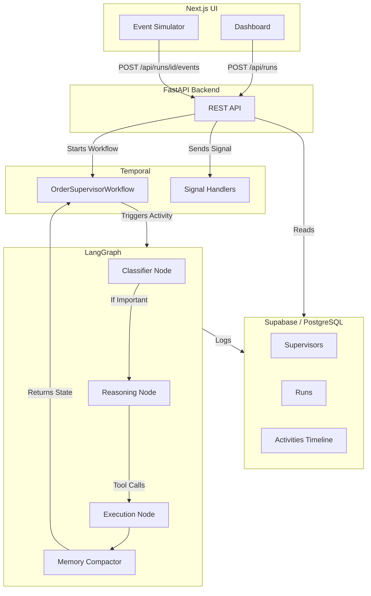

# System Architecture: SagePilot

SagePilot implements a highly durable, event-driven Agent architecture. To solve the problem of long-running autonomous agents reliably, we decoupled the **Cognitive Runtime** (the agent's brain) from the **Orchestration Engine** (the agent's body).

## Core Architecture

1. **Temporal (The Orchestrator):** 
   Temporal manages the lifecycle of each order as a separate, durable workflow. Temporal guarantees that even if our backend crashes or is restarted, the workflow's state is preserved. Temporal handles the event loop: it listens for external signals (events, manual instructions) and manages the timer for scheduled wake-ups.
   
2. **LangGraph & Groq (The Cognitive Engine):**
   When Temporal determines it is time for the agent to wake up, it executes a "cognitive loop" Activity. This triggers a LangGraph state graph. We use **Groq** (`llama-3.3-70b-versatile`) as the LLM engine for extremely fast inference, making the cognitive loop execute in just a few seconds.

3. **Supabase (Persistence & State):**
   Instead of storing the entire LLM message history inside the Temporal workflow state (which causes bloat and payload limit issues), we store all activities in a Supabase PostgreSQL database. 

## The Cognitive Loop (LangGraph)

When the agent wakes up, it executes a 4-node graph:

1. **Classifier Node:** A lightweight LLM call that looks at the incoming event and the current memory. It decides if the event is important enough to warrant full reasoning, or if the agent should just go back to sleep. This prevents wasting tokens on trivial updates (e.g., "location ping").
2. **Reasoning Node:** If the classifier flags the event as important, the main agent reads the full context, the manual instructions, and the current memory. It decides what tool to use and whether the workflow is complete.
3. **Execution Node:** Evaluates the tool calls generated by the reasoning node (e.g., `message_customer`, `create_internal_note`).
4. **Memory Compaction Node:** Re-summarizes the agent's internal memory string based on the recent activities, ensuring the context window never exceeds a strict limit.

## Workflow Lifecycle

1. A Next.js API call creates a new run in Supabase and starts a Temporal workflow.
2. The workflow enters a `while not completed` loop.
3. The workflow blocks, waiting for one of three triggers:
   - A new event signal arrives.
   - A manual instruction signal arrives.
   - A sleep timer expires (determined by the agent in a previous loop).
4. The workflow invokes the `run_agent_cognitive_loop` Activity.
5. If the agent determines the order is finished (or if a terminate signal is sent from the UI), the loop exits.
6. The workflow invokes a final `run_final_summary_activity` to produce end-of-run learnings and feedback.

## Extensibility

This architecture is designed for scale. By keeping Temporal strictly focused on state and timers, and LangGraph strictly focused on reasoning, we can easily plug in new tools, swap LLM providers, or add multiple cooperating sub-agents without rewriting the core durability logic.
